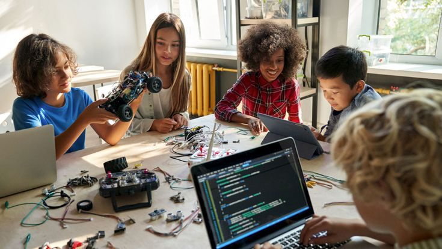
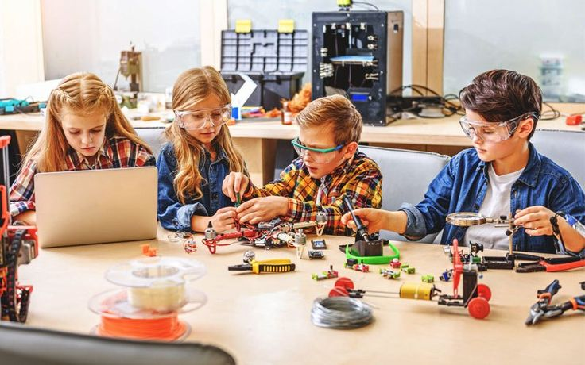

# 📘 Proposal for 3-Month Short-Term Courses in Programming, IoT, Robotics, and Arduino

**Submitted by:**  
Denuwan Wijesinghe  
BSc (Hons) in Artificial Intelligence – University of Moratuwa  
Founder – Demetrix Co. | Member at IoT & Embedded Systems Labs
Faculty of IT | Cisco Certified | GenAI, AI Agents & Web Dev Certified  

---

## 🔹 1. Introduction

*Young students engaging in hands-on tech learning*

We propose to launch a **3-month short-term educational program** to introduce school students (Grade 5 and above) to **Programming, IoT, and Robotics** through interactive, project-based learning using custom-built **Arduino kits**. Upon completion, each student will receive a **certificate** and showcase their projects at a **Demo Day**.

This initiative aims to **nurture creativity, critical thinking**, and build early-stage technical confidence in young minds.

---

## 🔹 2. Objectives

- Deliver foundational tech education using a **hands-on, project-based approach**
- Offer **flexible course structures** suitable for different age groups
- Conduct **workshops and school demos** to increase engagement and awareness
- Provide **affordable kits and certifications** for each student

---

## 🔹 3. Target Audience

- **Primary Group:** Grade 5 – A/L students  
- **Secondary Group:** Tech clubs, coding clubs, and rural outreach initiatives  
- **Batch Size:** 20–30 students per session

---

## 🔹 4. Course Flow (Flexible & Modular)

| Level | Focus Areas | Tools / Projects |
|-------|-------------|------------------|
| **Beginner (G5–8)** | Scratch, Tinkercad, Arduino Basics | LED blink, buzzer alarm, water sensor |
| **Intermediate (G9–11)** | Python, Serial Monitor, sensors, motors | Bluetooth car, smart light system |
| **Advanced (G12–A/L)** | Full project builds, intro to IoT & AI | Line-following robot, smart irrigation |

- **12-week course** (1–2 sessions/week, 1.5–2 hours per session)
- Every student works hands-on with a real **Arduino kit**
- **End-of-course Certificate + Demo Day**

---

## 🔹 5. Learning Materials & Kit Quotation

Each student receives a standard kit:

| Component | Quantity | Est. Unit Cost (LKR) | Total (LKR) |
|----------|----------|----------------------|-------------|
| Arduino UNO (Clone) | 1 | 1500 | 1500 |
| Breadboard | 1 | 200 | 200 |
| Jumper Wires Set | 1 | 250 | 250 |
| LEDs (Red, Green, Yellow) | 10 | 5 x 10 = 50 | 50 |
| Resistors Pack | 1 | 100 | 100 |
| Ultrasonic Sensor (HC-SR04) | 1 | 350 | 350 |
| Buzzer | 1 | 80 | 80 |
| LDR + Light Sensor | 1 | 100 | 100 |
| Servo Motor | 1 | 300 | 300 |
| Battery Pack + Holder | 1 | 200 | 200 |
| USB Cable | 1 | 150 | 150 |
| **Total** | | | **~3,280 LKR** |

> 💡 Bulk purchases can reduce the price per kit to ~2,800 LKR.

---

## 🔹 6. Revenue Model

| Cost Item | Per Student (LKR) |
|-----------|--------------------|
| Course Kit (retained by student) | 2800 |
| Course Materials & Printing | 500 |
| Instructor & Venue | 1200 |
| **Total Cost per Student** | ~4,500 LKR |
| **Suggested Fee** | 5,000 – 6,000 LKR (flexible by region/school) |

---

## 🔹 7. Marketing & Outreach Strategy

### 📣 1. School-Based Awareness Workshops
- Free/low-cost demo sessions in schools (Grade 5–A/L)
- Hands-on activities using LEDs/sensors
- Certificates of participation
- Promote full course during these workshops

### 📲 2. Digital Marketing
- Use Meta Ads (Facebook/Instagram) targeting parents & students
- Share videos, student testimonials, and project demos
- Partner with school Facebook pages/groups for reach

### 🎤 3. Influencer & Teacher Outreach
- Collaborate with ICT teachers & STEM club coordinators
- Offer referral discounts for teacher-recommended students

### 🧑‍🏫 4. Community Presence
- Booths at local educational expos
- Pop-up STEM labs at tuition centers or events

### 🧪 5. Build the Brand
- Program name ideas: “CodeSpark Junior”, “TechWave Kids”
- Branded kits, t-shirts, certificates
- Microsite/landing page for registration and inquiries

---

## 🔹 8. Sustainability & Expansion Plan

- Reuse model in other districts with local instructor hubs
- Create course "levels" for progressive learning
- Add optional online components (recorded lessons + quizzes)
- Offer train-the-trainer modules to expand reach

---

## 🔹 9. Team Structure

- **Instructors:** Selected peers from AI, CS, and Engineering faculties  
- **Support Team:** Logistics, design, content creators, and mentors  

---

## 🔹 10. Conclusion

With a modular, hands-on approach backed by a strong promotional strategy, this initiative promises high engagement, affordable tech education, and real-world impact. We’re not just teaching — we’re inspiring the next generation of **tech creators**.

With your support, we can turn this vision into a sustainable **educational movement**.

---

## 🔹 Existing Robotics & STEM Education Providers in Sri Lanka

| Institution | Website |
|------------|---------|
| Meu Labs | [meulabs.org](https://meulabs.org) |
| RoboticGen | [roboticgen.co](https://roboticgen.co) |
| Future Robotics Academy | [futureroboticsacademy.lk](https://futureroboticsacademy.lk) |
| Southern IRAA | [southerniraa.lk](https://www.southerniraa.lk) |
| edMinds Academy | [edu.edminds.lk](https://edu.edminds.lk) |
| Academy of Robotics – Sri Lanka Robotics Education | [srilankarobotics.lk](https://srilankarobotics.lk) |
| Mechatronix Institute for Robotic Engineering (MIRE) | [mire.lk](https://mire.lk) |

